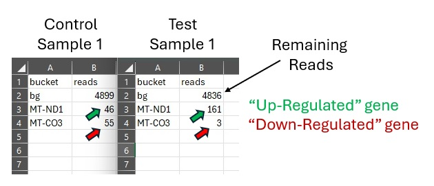
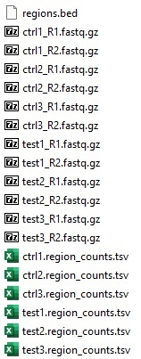

 
# Fastq Mini Data Generator

## Overview:
Did you ever need a mini fastq dataset for testing? This script will generate one for you. "AccioFastq.py" is a Harry Potter reference ;)

## Features:
- Differential expression in your gene/region of choice - great for RNA-seq or ChIP-Seq pipeline testing
- Cell Barcodes: UMI, Cell BC, both, or neither
- Pick your library size, target sequence, read length, etc. Go to town.

## Flags:
| Flag | Feature |
|---|---|
| --fasta | your target sequence |
|--fasta: |your target sequence|
|--outdir: |your output folder name|
|--layout: |single or paired-end reads (SE, PE)|
|--reads: |Number of reads (e.g. 5000)|
|--read-len: |Read length (e.g. 75)|
|--umi-len |UMI length (e.g. 10)|
|--cb-len 0|Cell Barcode length (e.g. 10)|
|--up-region 3307:4262|Up-regulated region/gene nuc range|
|--down-region 9207:9990|Down-regulated region/gene nuc. range|
|--up-name MT-ND1|Up-regulated gene/region name|
|--down-name MT-CO3|Down-regulated gene/region name|
|--up-mult 4|Up-regulated gene fold multiplier|
|--down-mult 0.05|Down regulated gene fold multiplier|
|--seed 42|Any random number|
|--verbose|Reports generation progress. Recommend: on|

# Outputs: (PE flag)
- 3 Control samples (e.g. ctrl1_R1.fastq.gz / ctrl1_R1.fastq.gz)
- 3 Test samples (e.g. test1_R1.fastq.gz / test1_R1.fastq.gz)
- Bed file with the coordinates and names of the up/down regulated genes
- Metrics files (1 per sample) show the up/down-regulated gene name and the number of reads in control/test  
 

# Usage example:
python AccioFastq.py \\ 
    --fasta chrM.fa \\ 
    --outdir fastq \\ 
    --layout PE \\ 
    --reads 5000 \\ 
    --read-len 75 \\ 
    --umi-len 10 \\ 
    --cb-len 0 \\ 
    --up-region 3307:4262 \\ 
    --down-region 9207:9990 \\ 
    --up-name MT-ND1 \\ 
    --down-name MT-CO3 \\ 
    --up-mult 4 \\ 
    --down-mult 0.05 \\ 
    --seed 42 \\ 
    --verbose